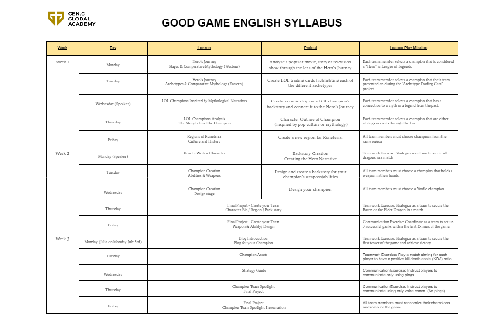
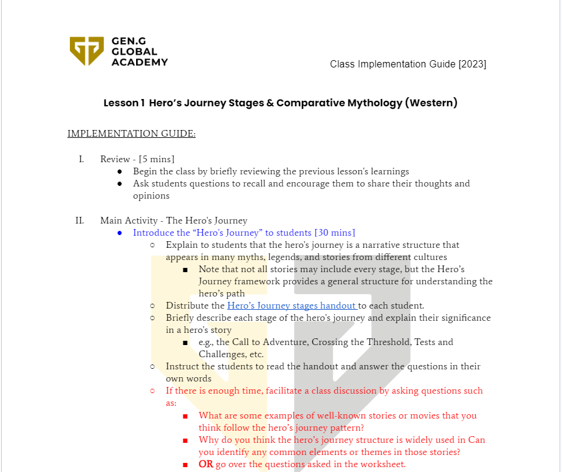

  
  
  

During my internship at Gen. G Esports, I led the development of an educational curriculum titled Good Game English, a unique program designed to blend language learning with gaming. This project was specifically created for middle school students attending summer sessions, and it sought to enhance their English language skills by incorporating elements from the popular game League of Legends.

The challenge was to develop a curriculum that not only met educational standards but also actively engaged students through their passion for gaming. Over the course of the internship, I worked alongside a team to create three weeks' worth of lesson plans. These lessons balanced gaming mechanics with language learning exercises, utilizing in-game terminology, character dialogue, and strategic thinking as ways to improve vocabulary, reading comprehension, and communication skills.

Each week’s lesson was designed to hit specific engagement and learning quotas, which required us to constantly revise and test new approaches to ensure maximum student participation. We implemented quizzes, team-based activities, and discussions that leveraged the social and collaborative aspects of gaming to foster teamwork and critical thinking in the classroom.

Beyond creating the curriculum, I had the opportunity to present our work during several large-scale presentations in Hawaii. These presentations were aimed at showcasing the potential of combining esports with education, and they provided a platform to highlight the positive impact of gaming in a structured, academic setting. I also addressed feedback from educators and peers to refine the curriculum further.

