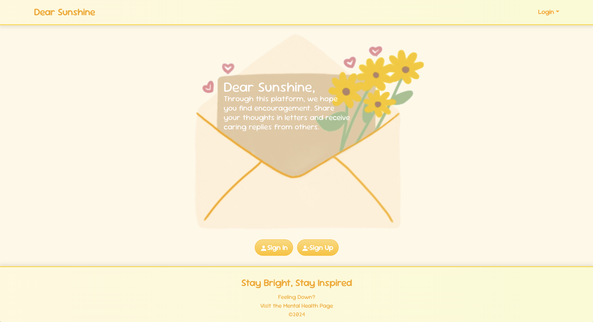
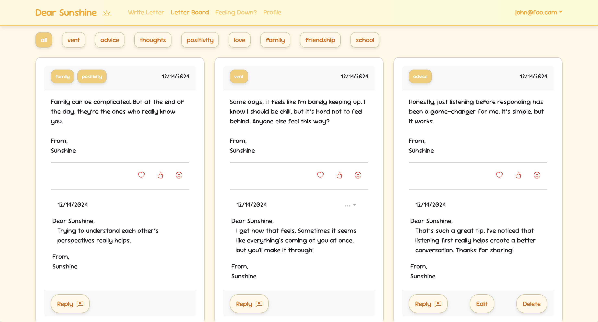

# Dear Sunshine 
Dear Sunshine is a program where users can post letters to a "letter board" when they need encouragement or want to vent. The application allows others to respond to these letters, offering support and kindness. The goal is to create a friendly, uplifting environment that brightens someone's day.

Many people experience feelings of isolation or sadness and could benefit from positive, uplifting messages to brighten their day. While social media allows for sharing updates, it lacks a dedicated space where users can anonymously send and receive encouragement within a supportive community. Dear Sunshine addresses this gap by providing a platform where users can receive kind messages in response to what they've shared or vented about on the board.

## My Contributions:
I worked primarily on the front-end development of the application. Using tools like React and Bootstrap, I helped create a user interface that ensures a seamless user experience. This included developing the main dashboard, message creation forms, and an aesthetic.

## What I Learned:
This experience taught me the importance of teamwork in software development. I gained valuable insight into balancing user needs with technical constraints and honed my React and CSS skills. Additionally, I learned how to integrate feedback from user testing into actionable design improvements.

## Screenshots:
Homepage

Discussion/Letter Pagey

## Source Code:
* [Dear Sunshine Organization](https://github.com/dear-sunshine)
* [Current Home Page's Repository](https://github.com/dear-sunshine/dear-sunshine.github.io/tree/main)
* [Project Page's Repository](https://github.com/dear-sunshine/dear-sunshine)

## Deployment
* [Dear Sunshine](https://dearsunshine.vercel.app/)
