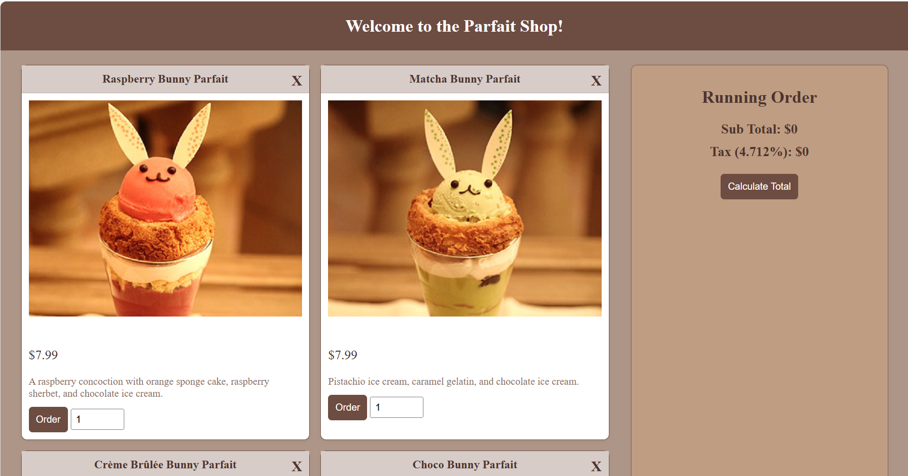

This parfait shop website was developed as part of a project aimed at improving my skills in HTML, CSS, and JavaScript. The site allows users to browse and order from a selection of four parfaits. JavaScript functions are used to handle user input, such as selecting items and quantities, updating the running order list, and calculating the subtotal and grand total, including tax.

Throughout the project, I learned key concepts like DOM manipulation (using commands to select elements by their ID), updating HTML dynamically, and handling order data. One challenge I faced was ensuring accurate calculation of order totals, which helped me improve my understanding of data types and error handling in JavaScript.

While I was responsible for both the design and coding aspects, I received guidance when debugging issues with updating the order summary. This project emphasized the importance of clean data handling and helped refine my web development skills.

[Click here to see project.](https://github.com/Kmiks/Parfait-Shop)
